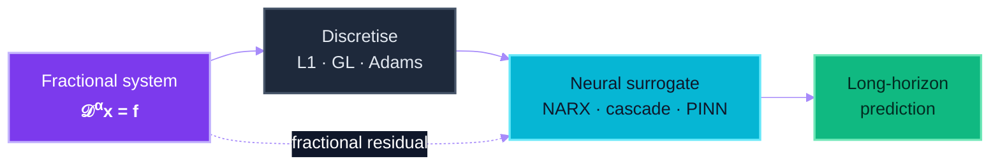
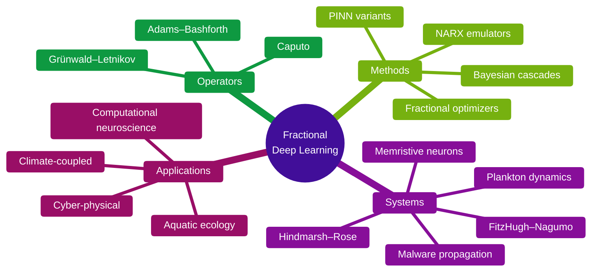

<picture>
  <source media="(prefers-color-scheme: dark)" srcset="assets/profile/hero-dark.png">
  
</picture>

<h1 align="center">Muhammad Junaid Ali Asif Raja</h1>

<p align="center">
  <b>Pioneering · Engineering · Crafting&nbsp; Fractional Deep Learning</b><br>
  <sub>Machine Learning Research &nbsp;·&nbsp; Direct PhD &nbsp;·&nbsp; Fractional Intelligent Computing Lab &nbsp;·&nbsp; National Yunlin University of Science &amp; Technology &nbsp;·&nbsp; Douliu, Taiwan</sub>
</p>

<p align="center">
  <a href="https://junaidaliop.github.io"></a>
  <a href="https://scholar.google.com/citations?user=9VTFIJcAAAAJ"></a>
  <a href="https://orcid.org/0009-0008-9249-9983"></a>
  <a href="https://junaidaliop.github.io/assets/pdf/cv.pdf"></a>
  <a href="mailto:muhammadjunaidaliasifraja@gmail.com"></a>
</p>

<p align="center">
  
  
  
  
  
  
  <a href="mailto:muhammadjunaidaliasifraja@gmail.com"></a>
</p>

> [!IMPORTANT]
> **Thesis.** Classical solvers spend most of their budget evaluating memory kernels.
> Deep networks, given the right structure, can absorb those kernels in a single forward pass.

---

## Programme

I am **pioneering Fractional Deep Learning** — a coherent family of neural architectures, training objectives, and optimizers built around fractional-order operators. The class of systems under study is

$$ {}^{C}_{\,0}\mathcal{D}^{\alpha}_{t}\,x(t) \;=\; f\!\big(x(t),\,x(t-\tau),\,t\big), \qquad 0 < \alpha \leq 1, $$

and the trained surrogate $x_\theta$ minimises a fractional-residual criterion

$$ \mathcal{L}(\theta) \;=\; \sum_{t}\big\Vert\, x_\theta(t) - x(t)\,\big\Vert_{2}^{2} \;+\; \lambda\,\big\Vert\, {}^{C}_{\,0}\mathcal{D}^{\alpha}_{t}\,x_\theta(t) \,-\, f\!\big(x_\theta(t),\,x_\theta(t-\tau),\,t\big)\,\big\Vert_{2}^{2}, $$

so the network must be correct pointwise *and* correct under the fractional operator.

```python
from dataclasses import dataclass, field

@dataclass(frozen=True)
class FractionalDeepLearning:
    """A coherent research programme around fractional-order operators."""
    vectors: list[str] = field(default_factory=lambda: [
        "fractional-aware optimizers for deep networks",
        "autoregressive neural emulators for fractional-order systems",
        "physics-informed losses with non-local memory kernels",
        "long-memory dynamics: cyber-physical, neuronal, ecological",
    ])
    alpha:   float = 0.95         # fractional order, Caputo sense
    horizon: int   = 1024         # rollout steps for long-memory rollouts
    kernel:  str   = "caputo"     # caputo | grunwald-letnikov | adams-bashforth
    solver:  str   = "L1-scheme"  # baseline against which surrogates compete
```



---

## Currently · 2026-Q2

| | Track | Open question |
|:-:|:--|:--|
| 🟣 | **Cyber-physical systems** | Fractional malware propagation on air-gapped industrial networks — what governs the long tail? |
| 🟣 | **Computational neuroscience** | Bursting transitions in fractional Hindmarsh–Rose & memristive neurons — recoverable from short windows? |
| 🔵 | **Aquatic ecology** | Toxin–plankton–nutrient dynamics under climate forcing — surrogate or stiff solver? |
| 🟢 | **Fractional optimization** | Memory-aware gradient updates — when do they outperform Adam, and on which loss landscapes? |

---

<p align="center">
  <picture>
    
  </picture>
</p>
<p align="center"><sub><i>signature.svg — animated phase trace of a fractional bursting neuron, rendered live in your browser.</i></sub></p>

---

## Repositories

<table>
  <tr>
    <td width="50%" valign="top">
      <h3><a href="https://github.com/junaidaliop/optim">optim</a></h3>
      Fractional-calculus-inspired optimizers for deep networks. The empirical backbone of the <i>Fractional optimization</i> track above.
      <br><br>
      
    </td>
    <td width="50%" valign="top">
      <h3><a href="https://github.com/junaidaliop/MobileNetV4">MobileNetV4</a></h3>
      Clean PyTorch replication of the MobileNetV4 architecture — for benchmarking surrogate backbones against modern efficient nets.
      <br><br>
      
      
    </td>
  </tr>
  <tr>
    <td width="50%" valign="top">
      <h3><a href="https://github.com/junaidaliop/MNIST-SOPCNN">MNIST-SOPCNN</a></h3>
      Self-organizing polynomial CNN reference implementation. Useful when polynomial activations enter the fractional-network design space.
      <br><br>
      
      
    </td>
    <td width="50%" valign="top">
      <h3><a href="https://github.com/junaidaliop/daily-research-paper-recommender">daily-research-paper-recommender</a></h3>
      Personalised arXiv-style daily recommender — runs in-lab to surface fractional-calculus and SciML preprints worth reading.
      <br><br>
      
      
    </td>
  </tr>
</table>

---

## Selected work

> [!NOTE]
> Eight papers, grouped by track. The full record lives on the <a href="https://junaidaliop.github.io/publications/">publications page</a>.

### Computational neuroscience — fractional & memristive neurons

1. **A Hybrid Neural-Computational Paradigm for Complex Firing Patterns and Excitability Transitions in Fractional Hindmarsh–Rose Neuronal Models.** *Chaos, Solitons & Fractals*, 2025. &nbsp; [](https://doi.org/10.1016/j.chaos.2025.116149)
2. **Design of Intelligent Bayesian-Regularized Deep Cascaded NARX Neurostructure for Predictive Analysis of FitzHugh-Nagumo Bioelectrical Model in Neuronal Cell Membrane.** *Biomedical Signal Processing and Control*, 2025. &nbsp; [](https://doi.org/10.1016/j.bspc.2024.107192)
3. **A Hybrid Intelligent Computational Framework for Diverse Firing Patterns in a Fractional-Order Locally Active Memristive Neuron Model.** *Chaos, Solitons & Fractals*, 2026. &nbsp; [](https://doi.org/10.1016/j.chaos.2026.118209)

### Aquatic ecology — *Water Research*

4. **Neuro-Computational Surrogates for Aqueous Fractional-Order Nekton-Plankton Spatiotemporal Dynamics Under Toxicant Stress, Refuge Efficacy, and Nutrient Flux Modulation.** *Water Research*, 2026. &nbsp; [](https://doi.org/10.1016/j.watres.2025.124754)
5. **Design of a Fractional-Order Environmental Toxin-Plankton System in Aquatic Ecosystems: A Novel Machine Predictive Expedition with Nonlinear Autoregressive Neuroarchitectures.** *Water Research*, 2025. &nbsp; [](https://doi.org/10.1016/j.watres.2025.123640)

### Cyber-physical systems — fractional malware propagation

6. **Design of Deep Learning Networks for Nonlinear Delay Differential System for Stuxnet Virus Spread in an Air-Gapped Critical Environment.** *Applied Soft Computing*, 2025. &nbsp; [](https://doi.org/10.1016/j.asoc.2025.113091)
7. **Machine Learning Knowledge Driven Investigation for Immunity Infused Fractional Industrial Virus Transmission in SCADA Systems.** *Journal of Industrial Information Integration*, 2025. &nbsp; [](https://doi.org/10.1016/j.jii.2025.100940)

### Climate-coupled dynamics — *Engineering Applications of AI*

8. **Bayesian-Regularized Cascaded Neural Networks for Fractional Asymmetric Carbon–Thermal Nutrient–Plankton Dynamics Under Global Warming and Climatic Perturbations.** *Engineering Applications of Artificial Intelligence*, 2025. &nbsp; [](https://doi.org/10.1016/j.engappai.2025.110739)

<details>
<summary><b>Full record</b> — 27&#43; papers · talks · awards</summary>

&nbsp;

The complete list lives on the [publications page](https://junaidaliop.github.io/publications/); citation metrics on [Google Scholar](https://scholar.google.com/citations?user=9VTFIJcAAAAJ).

</details>

---

## Research mindmap



---

<p align="center">
  
</p>
<p align="center"><sub><i>Generative phase-portrait — produced via Codex image generation, post-processed for the README backplate.</i></sub></p>

---

```toml
[profile]
name      = "Muhammad Junaid Ali Asif Raja"
role      = "Machine Learning Research, Direct PhD"
programme = "Fractional Deep Learning"
lab       = "Fractional Intelligent Computing Lab"
affiliation = "National Yunlin University of Science & Technology"
location  = "Douliu, Taiwan"

[contact]
email      = "muhammadjunaidaliasifraja@gmail.com"
portfolio  = "https://junaidaliop.github.io"
scholar    = "https://scholar.google.com/citations?user=9VTFIJcAAAAJ"
orcid      = "https://orcid.org/0009-0008-9249-9983"
cv         = "https://junaidaliop.github.io/assets/pdf/cv.pdf"

[status]
open-to    = ["collaborations", "internships", "fractional-DL discussions"]
updated    = "2026-05"
```
