<picture>
  <source media="(prefers-color-scheme: dark)" srcset="assets/profile/hero-dark.png">
  
</picture>

<p align="center"><i>Networks should learn under fractional operators, not despite them.</i></p>

<h1 align="center">Muhammad Junaid Ali Asif Raja</h1>

<p align="center">
  <a href="https://junaidaliop.github.io"></a>
  <a href="https://scholar.google.com/citations?user=9VTFIJcAAAAJ"></a>
  <a href="https://orcid.org/0009-0008-9249-9983"></a>
  <a href="https://junaidaliop.github.io/assets/pdf/cv.pdf"></a>
  <a href="mailto:muhammadjunaidaliasifraja@gmail.com"></a>
</p>

```toml
[profile]
name        = "Muhammad Junaid Ali Asif Raja"
role        = "Machine Learning Research"
position    = "Direct-entry PhD"
lab         = "Fractional Intelligent Computing Lab"
affiliation = "National Yunlin University of Science & Technology"
location    = "Douliu, Taiwan"

[contact]
portfolio   = "https://junaidaliop.github.io"
scholar     = "https://scholar.google.com/citations?user=9VTFIJcAAAAJ"
orcid       = "0009-0008-9249-9983"
cv          = "https://junaidaliop.github.io/assets/pdf/cv.pdf"
email       = "muhammadjunaidaliasifraja@gmail.com"

[status]
open-to     = ["collaborations", "internships", "fractional-DL discussions"]
last-update = "2026-05"
```

---

## Fractional Deep Learning

I am working on **Fractional Deep Learning**, a thread within Scientific Machine Learning (SciML) that brings the tools of fractional calculus into deep learning. The premise is that long-range memory in real systems is captured parametrically by fractional operators (Caputo[^caputo], Grünwald–Letnikov[^gl], Riemann–Liouville[^rl]). The open question is whether networks can *learn under* those operators rather than approximating them from outside.

The toolkit spans **physics-informed neural networks (PINNs)**, **neural operators**, **intelligent surrogates** for fractional-order systems, **fractional-inspired optimization**, and **fractional spiking neural networks (FSNNs)**. The leaky integrate-and-fire (LIF) cell is taken into Caputo dynamics; the domains follow the same constraint, wherever memory is the structure rather than the noise.

<table>
<tr><th align="left">Methods</th><th align="left">Domains</th></tr>
<tr><td valign="top">

- physics-informed neural networks (PINNs)
- neural operators
- intelligent surrogates
- fractional-inspired optimization
- fractional spiking neural networks (FSNNs)

</td><td valign="top">

- fractional-order differential systems
- computational neuroscience (Hindmarsh–Rose, FitzHugh–Nagumo, memristive neurons)
- cyber-physical systems (delay-differential malware, SCADA security)
- aquatic ecology (toxin / plankton / nutrient dynamics)
- climate-coupled forcing

</td></tr>
</table>

The field is young. That is the point.

```python
from dataclasses import dataclass, field

@dataclass(frozen=True)
class FractionalDeepLearning:
    """A SciML thread bringing fractional calculus into deep learning."""
    methods:  tuple[str, ...] = (
        "physics-informed neural networks  (PINNs)",
        "neural operators",
        "intelligent surrogates",
        "fractional-inspired optimization",
        "fractional spiking neural networks  (FSNNs)",
    )
    domains:  tuple[str, ...] = (
        "fractional-order differential systems",
        "computational neuroscience",
        "cyber-physical systems",
        "aquatic ecology",
        "climate-coupled dynamics",
    )
    alpha:    float = 0.95          # fractional order, Caputo sense
    kernel:   str   = "caputo"      # caputo | grunwald-letnikov | riemann-liouville
    horizon:  int   = 1024          # rollout horizon for long-memory dynamics
    open:     bool  = True          # research direction still taking shape
```

---

## Open questions

1. **Fractional-order spiking neural networks for neuromorphic systems.** Neuromorphic substrates are memory-cheap by design. Can fractional-inspired spiking add useful memory to a memory-cheap setup without giving back the efficiency that made it interesting in the first place? Open.
2. **Fractional-order optimization at scale.** Memory-aware gradient updates introduce per-parameter state, drawn from the full history of the optimisation trajectory. Is the bookkeeping ever feasible at large-language-model scale? Open.

---

## Selected work

1. **A Hybrid Neural-Computational Paradigm for Complex Firing Patterns and Excitability Transitions in Fractional Hindmarsh–Rose Neuronal Models.** *Chaos, Solitons & Fractals*, 2025. &nbsp; [](https://doi.org/10.1016/j.chaos.2025.116149)
2. **Design of Intelligent Bayesian-Regularized Deep Cascaded NARX Neurostructure for Predictive Analysis of FitzHugh–Nagumo Bioelectrical Model in Neuronal Cell Membrane.** *Biomedical Signal Processing and Control*, 2025. &nbsp; [](https://doi.org/10.1016/j.bspc.2024.107192)
3. **A Hybrid Intelligent Computational Framework for Diverse Firing Patterns in a Fractional-Order Locally Active Memristive Neuron Model.** *Chaos, Solitons & Fractals*, 2026. &nbsp; [](https://doi.org/10.1016/j.chaos.2026.118209)
4. **Neuro-Computational Surrogates for Aqueous Fractional-Order Nekton–Plankton Spatiotemporal Dynamics Under Toxicant Stress, Refuge Efficacy, and Nutrient Flux Modulation.** *Water Research*, 2026. &nbsp; [](https://doi.org/10.1016/j.watres.2025.124754)
5. **Design of a Fractional-Order Environmental Toxin–Plankton System in Aquatic Ecosystems: A Novel Machine Predictive Expedition with Nonlinear Autoregressive Neuroarchitectures.** *Water Research*, 2025. &nbsp; [](https://doi.org/10.1016/j.watres.2025.123640)
6. **Design of Deep Learning Networks for Nonlinear Delay Differential System for Stuxnet Virus Spread in an Air-Gapped Critical Environment.** *Applied Soft Computing*, 2025. &nbsp; [](https://doi.org/10.1016/j.asoc.2025.113091)
7. **Machine Learning Knowledge Driven Investigation for Immunity Infused Fractional Industrial Virus Transmission in SCADA Systems.** *Journal of Industrial Information Integration*, 2025. &nbsp; [](https://doi.org/10.1016/j.jii.2025.100940)
8. **Bayesian-Regularized Cascaded Neural Networks for Fractional Asymmetric Carbon–Thermal Nutrient–Plankton Dynamics Under Global Warming and Climatic Perturbations.** *Engineering Applications of Artificial Intelligence*, 2025. &nbsp; [](https://doi.org/10.1016/j.engappai.2025.110739)

Full record on the [publications page](https://junaidaliop.github.io/publications/).

```bibtex
@article{raja2025hybrid,
  title   = {A hybrid neural-computational paradigm for complex firing
             patterns and excitability transitions in fractional
             Hindmarsh--Rose neuronal models},
  author  = {Raja, Muhammad Junaid Ali Asif and others},
  journal = {Chaos, Solitons \& Fractals},
  year    = {2025},
  doi     = {10.1016/j.chaos.2025.116149}
}
```

---

## Education

1. **Direct-entry PhD**, Computer Science & Information Engineering. *National Yunlin University of Science & Technology*, Taiwan. 2024 – present.
2. **BE, Electrical Engineering** (Embedded Systems & Artificial Intelligence). *School of Electrical Engineering & Computer Science (SEECS), National University of Sciences & Technology (NUST)*, Pakistan. 2019 – 2023.

## Honors

**Phi Tau Phi Scholastic Honor Society**, Republic of China chapter, 2025. Top 2% of graduate master's students.

## Mentoring

Mentoring research students in **fractional deep learning** and on **intelligent neural surrogates for nonlinear dynamical system reconstruction**.

## Stack

```toml
[stack]
languages   = ["Python", "Julia", "MATLAB"]
ml          = ["PyTorch", "JAX"]
numerical   = ["NumPy", "SciPy", "DifferentialEquations.jl"]
typeset     = "LaTeX"
notebook    = "Jupyter"
shell       = ["Git", "Linux"]
```

---

<p align="center">
  
</p>

<p align="center">
  
</p>

<p align="center"><sub>Open to collaborations. Reach me at <a href="mailto:muhammadjunaidaliasifraja@gmail.com">muhammadjunaidaliasifraja@gmail.com</a>.</sub></p>

[^caputo]: **Caputo derivative.** Convolutional kernel with classical initial conditions; the default in physics-informed fractional models.
[^gl]: **Grünwald–Letnikov.** Limit-of-finite-differences formulation; natural for discrete-time schemes and FSNN dynamics.
[^rl]: **Riemann–Liouville.** Analytic baseline; integer-order initial data is non-trivial, which is why Caputo dominates engineering work.
