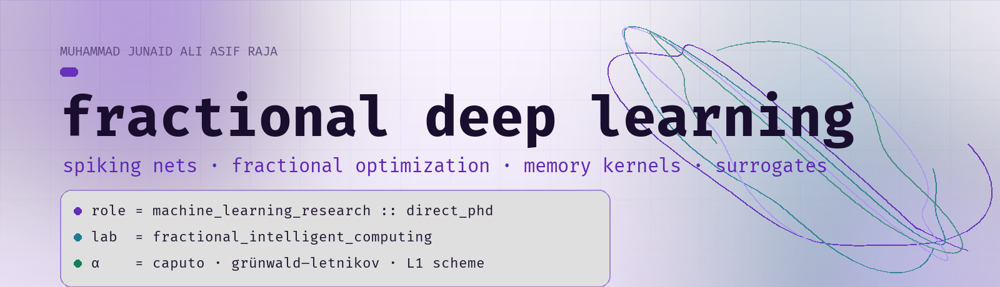
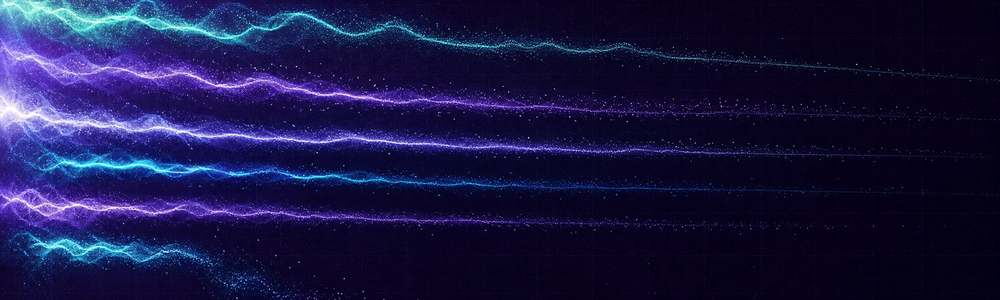
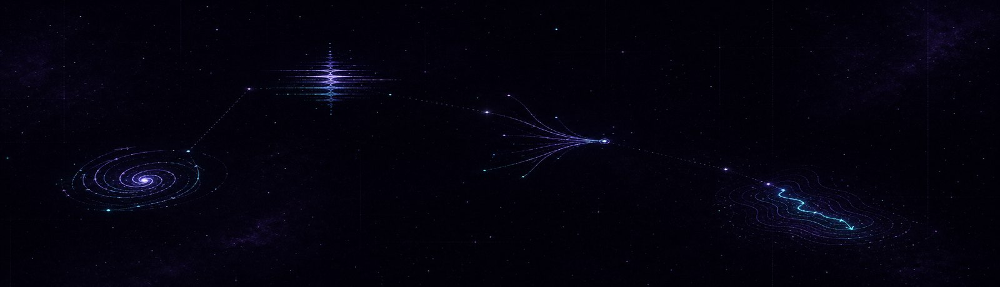

<picture>
  <source media="(prefers-color-scheme: dark)" srcset="assets/profile/hero-dark.png">
  
</picture>

<p align="center"><i>Networks should learn under fractional operators, not despite them.</i></p>

<h1 align="center">Muhammad Junaid Ali Asif Raja</h1>

<p align="center">
  <sub>Machine Learning Research &nbsp;·&nbsp; Direct-entry PhD &nbsp;·&nbsp; Fractional Intelligent Computing Lab &nbsp;·&nbsp; National Yunlin University of Science &amp; Technology &nbsp;·&nbsp; Douliu, Taiwan</sub>
</p>

<p align="center">
  <a href="https://junaidaliop.github.io"></a>
  <a href="https://scholar.google.com/citations?user=9VTFIJcAAAAJ"></a>
  <a href="https://orcid.org/0009-0008-9249-9983"></a>
  <a href="https://junaidaliop.github.io/assets/pdf/cv.pdf"></a>
  <a href="mailto:muhammadjunaidaliasifraja@gmail.com"></a>
</p>

## Fractional Deep Learning

Real systems carry memory. A neuron's past spikes shape its present voltage. A plankton bloom remembers the season before. Malware on an air-gapped network remembers every infection event. Classical models throw that history away, or pay $\mathcal{O}(N^{2})$ at every step to keep it. That trade is what I want to fix.

**Fractional-order operators** — Caputo, Grünwald–Letnikov, Riemann–Liouville — encode long-range dependence parametrically. One number, $\alpha$, controls everything from a sharp spike to a power-law tail. The right question is no longer *how to approximate the operator from outside*, but *whether a network can learn under it from inside*.

Four research areas, all variations on the same question. **Fractional-order differential systems** — the math everything else stands on. **Computational neuroscience** — fractional Hindmarsh–Rose, FitzHugh–Nagumo, memristive neurons, and **fractional spiking neural networks (FSNNs)** — the leaky integrate-and-fire (LIF) cell lifted into Caputo-sense dynamics. **Intelligent surrogates** — NARX, Bayesian-regularized cascades, physics-informed neural networks (PINNs) that have to be right pointwise *and* right under the operator. **Deep-learning optimization algorithms** — because gradients themselves have memory, if you let them.

The class of systems under study and the criterion the surrogate $x_\theta$ minimizes:

$$ {}^{C}_{\,0}\mathcal{D}^{\alpha}_{t}\,x(t) \;=\; f\!\big(x(t),\,x(t-\tau),\,t\big), \qquad 0 < \alpha \leq 1 $$

$$
\begin{aligned}
\mathcal{L}(\theta) \;=\;& \sum_{t}\big\Vert\, x_\theta(t) - x(t)\,\big\Vert_{2}^{2} \\
                       +\;& \lambda\,\big\Vert\, {}^{C}_{\,0}\mathcal{D}^{\alpha}_{t}\,x_\theta(t) \,-\, f\!\big(x_\theta(t),\,x_\theta(t-\tau),\,t\big)\,\big\Vert_{2}^{2}
\end{aligned}
$$

Correct pointwise, *and* correct under the fractional operator.

<p align="center">
  
</p>
<p align="center"><sub><i>kernel-field — fractional decay envelopes, parametrized by α.</i></sub></p>

```python
import numpy as np
from scipy.special import gamma

def caputo_l1(x: np.ndarray, alpha: float, dt: float) -> np.ndarray:
    """L1 scheme for the Caputo derivative ⁿᵒᵗᵉ⁾ the baseline x_θ has to amortize."""
    n = len(x)
    b = np.array([(k + 1)**(1 - alpha) - k**(1 - alpha) for k in range(n)])
    out = np.zeros(n)
    coef = dt**(-alpha) / gamma(2 - alpha)
    for i in range(1, n):
        out[i] = coef * sum(b[k] * (x[i - k] - x[i - k - 1]) for k in range(i))
    return out
```

---

## Currently · 2026-Q2

| Track | Open question |
|:--|:--|
| **Cyber-physical systems** (CPS) | What mechanisms shape the heavy-tailed infection-time distribution of fractional malware propagation on air-gapped industrial networks — including SCADA (Supervisory Control and Data Acquisition) settings? |
| **Computational neuroscience** | Are bursting transitions in fractional Hindmarsh–Rose and memristive neurons recoverable from short observation windows? |
| **Aquatic ecology** | Can a neural surrogate match a stiff implicit solver on toxin–plankton–nutrient dynamics under non-stationary climate forcing? |
| **Fractional optimization** | When do memory-aware gradient updates outperform Adam, and on which loss landscapes? |
| **Fractional spiking nets** | What does a leaky integrate-and-fire (LIF) neuron look like under a Caputo memory kernel — and what does it gain over a smooth-rate counterpart? |

---

## Selected work

Eight papers, four tracks. Full record on the [publications page](https://junaidaliop.github.io/publications/).

1. *[computational neuroscience]* &nbsp; **A Hybrid Neural-Computational Paradigm for Complex Firing Patterns and Excitability Transitions in Fractional Hindmarsh–Rose Neuronal Models.** *Chaos, Solitons & Fractals*, 2025. &nbsp; [](https://doi.org/10.1016/j.chaos.2025.116149)
2. *[computational neuroscience]* &nbsp; **Design of Intelligent Bayesian-Regularized Deep Cascaded NARX Neurostructure for Predictive Analysis of FitzHugh–Nagumo Bioelectrical Model in Neuronal Cell Membrane.** *Biomedical Signal Processing and Control*, 2025. &nbsp; [](https://doi.org/10.1016/j.bspc.2024.107192)
3. *[computational neuroscience]* &nbsp; **A Hybrid Intelligent Computational Framework for Diverse Firing Patterns in a Fractional-Order Locally Active Memristive Neuron Model.** *Chaos, Solitons & Fractals*, 2026. &nbsp; [](https://doi.org/10.1016/j.chaos.2026.118209)
4. *[aquatic ecology]* &nbsp; **Neuro-Computational Surrogates for Aqueous Fractional-Order Nekton–Plankton Spatiotemporal Dynamics Under Toxicant Stress, Refuge Efficacy, and Nutrient Flux Modulation.** *Water Research*, 2026. &nbsp; [](https://doi.org/10.1016/j.watres.2025.124754)
5. *[aquatic ecology]* &nbsp; **Design of a Fractional-Order Environmental Toxin–Plankton System in Aquatic Ecosystems: A Novel Machine Predictive Expedition with Nonlinear Autoregressive Neuroarchitectures.** *Water Research*, 2025. &nbsp; [](https://doi.org/10.1016/j.watres.2025.123640)
6. *[cyber-physical systems]* &nbsp; **Design of Deep Learning Networks for Nonlinear Delay Differential System for Stuxnet Virus Spread in an Air-Gapped Critical Environment.** *Applied Soft Computing*, 2025. &nbsp; [](https://doi.org/10.1016/j.asoc.2025.113091)
7. *[cyber-physical systems]* &nbsp; **Machine Learning Knowledge Driven Investigation for Immunity Infused Fractional Industrial Virus Transmission in SCADA Systems.** *Journal of Industrial Information Integration*, 2025. &nbsp; [](https://doi.org/10.1016/j.jii.2025.100940)
8. *[climate-coupled dynamics]* &nbsp; **Bayesian-Regularized Cascaded Neural Networks for Fractional Asymmetric Carbon–Thermal Nutrient–Plankton Dynamics Under Global Warming and Climatic Perturbations.** *Engineering Applications of Artificial Intelligence*, 2025. &nbsp; [](https://doi.org/10.1016/j.engappai.2025.110739)

---

<p align="center">
  
</p>
<p align="center"><sub><i>constellation — the four threads sketched as a dark star chart.</i></sub></p>

---

## Repositories

- **[optim](https://github.com/junaidaliop/optim)** — fractional-calculus-inspired optimizers for deep networks; the code behind the *fractional optimization* thread above.
- **[MobileNetV4](https://github.com/junaidaliop/MobileNetV4)** — a clean PyTorch port of the MobileNetV4 architecture; used as a baseline backbone for surrogate-architecture experiments.
- **[MNIST-SOPCNN](https://github.com/junaidaliop/MNIST-SOPCNN)** — self-organizing polynomial CNN reference implementation.
- **[daily-research-paper-recommender](https://github.com/junaidaliop/daily-research-paper-recommender)** — a personal arXiv recommender for fractional-calculus and SciML preprints.

---

<p align="center">
  
</p>
<p align="center"><sub><i>signature.svg — animated time series of a fractional bursting neuron, rendered live in your browser.</i></sub></p>

<p align="center"><sub>Open to collaborations &nbsp;·&nbsp; <a href="mailto:muhammadjunaidaliasifraja@gmail.com">muhammadjunaidaliasifraja@gmail.com</a></sub></p>
